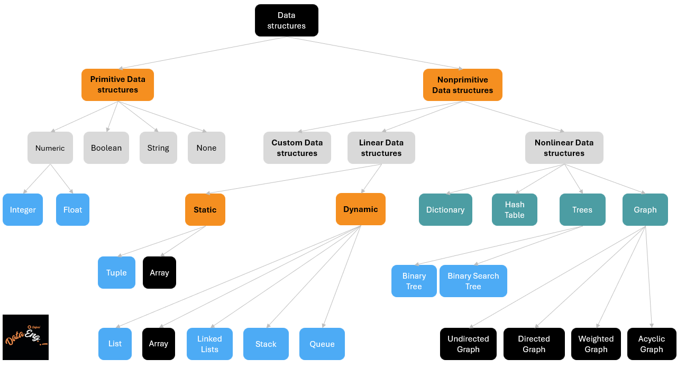
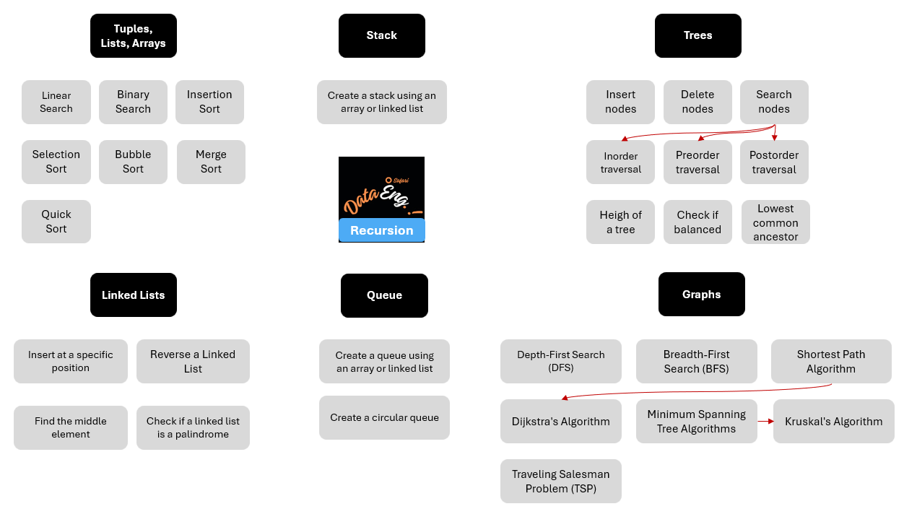

# 1. Data structures

**Linear** data structures have a linear arrangement of elements *with a specific order*, while **nonlinear** data structures have more complex relationships and *do not follow a strict sequential order*.

# 2. Algorithms

# 3. Complexity analysis: an introduction using `List` data structure

Complexity analysis helps us understand how the performance of an algorithm or data structure changes as the input size increases.

**A slightly formal definition of complexity**

Let's $F(x_n)$ be an algorithm which take $x_n$ as an input. $x_n$ can be a primitive data structure or nonprimitive one such as Tuple, List, .... We assume that the size of $x_n$ is equal to $n$.

Let's also consider that we have a function $\varphi$ which is a metric of the performance of the algorithm $F$. This performance can be measured in terms of execution time or disk space occupied, for example.

The complexity $\gamma$ of the algorithm $F$ represents how the metric $\varphi$ evolves as the size $n$ of the input $x_n$ tends towards infinity ($\infty$):

$$
\gamma = \lim_{n\to\infty} \varphi(F(x_n))
$$

* If $\varphi$ remains `constant` as $n$ increases, we have `constant complexity`. The complexity $\gamma$ is then noted as follows: $O(1)$: this is the `Big O notation`.

$$
\gamma = O(1)
$$

* If $\varphi$ increases `linearly` as $n$ increases, we say we have `linear complexity`. 

$$
\gamma = O(n)
$$

**Note: there are several types of complexity, which we'll examine later with the help of a few case studies.**

$$
\gamma = O(log \ n), \gamma = O(n \ log \ n), \gamma = O(n^2), ...
$$
